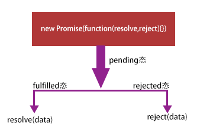
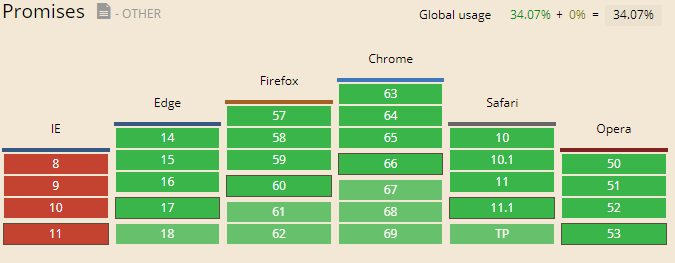

##### Promise 对象
> 1. [为什么出现了Promise对象？](#为什么出现了promise对象)
> 2. [Promise 是什么？](#promise是什么)
> 3. [Promise 怎么用？](#promise怎么用)
> 4. [Promise 兼容性？](#promise兼容性)

##### 为什么出现了Promise对象？
工作中会出现如下情形？
```javascript
    ajaxAsync(url,data,function(data) {
        ajaxAsync(url,data,function(data) {
            ajaxAsync(url,data,function(data) {
               ......        
            })
        })
    })
    // 导致的问题？
    // 代码嵌套层次太深，不利于维护，不美观
```
##### Promise是什么？
> 所谓Promise，简单说就是一个容器，里面保存着某个未来才会结束的事件（通常是一个异步操作）的结果。从语法上说，Promise 是一个对象，
从它可以获取异步操作的消息。Promise 提供统一的 API，各种异步操作都可以用同样的方法进行处理。
引用[阮一峰-ECMAScript 6 入门](http://es6.ruanyifeng.com/#docs/promise)

##### Promise怎么用？
3.1 上述问题的Promise解决？
```javascript
    var promise=new Promise(function(resolve,reject) {
        ajaxAsync(url,data,function(data) {
            if(success){
                resolve(data);
            }else{
                reject(data);
            }
        })
    });
    promise
     .then(function(dara) {return promiseObj;},function(error){return '';})
     .then(function(dara) {return promiseObj;},function(error){return '';})
     ...
```
3.1 Promise的三种状态
> 

3.2 Promise catch 方法
Promise.prototype.catch方法是.then(null, rejection)的别名，用于指定发生错误时的回调函数。
举个例子
```javascript
var promise=new Promise(function(resolve,reject) {
        ajaxAsync(url,data,function(data) {
                reject(data);
        })
    });
    promise
     //.then(null,function(error){})
     .catch(function(error){})
```
3.3 Promise.all()方法
p的状态由p1、p2、p3决定，分成两种情况。<br>
（1）只有p1、p2、p3的状态都变成fulfilled，p的状态才会变成fulfilled，此时p1、p2、p3的返回值组成一个数组，传递给p的回调函数。<br>
（2）只要p1、p2、p3之中有一个被rejected，p的状态就变成rejected，此时第一个被reject的实例的返回值，会传递给p的回调函数。
```javascript
    var promise1=new Promise(function (resolve,reject) {
      setTimeout(function () {
          resolve('success1');
      },100);
    });
    var promise2=new Promise(function (resolve,reject) {
      setTimeout(function () {
          resolve('success2');
      },1000);
    });
    var promise3=new Promise(function (resolve,reject) {
      setTimeout(function () {
          resolve('success3');
      },3000);
    });
    Promise.all([promise1,promise2,promise3]).then(function (data1,data2,data3) {
      console.log(data1,data2,data3);//3 秒之后就会触发 success1,success2,success3
    }).catch(function (error) {
      console.log(error)
    })
```
3.4 Promise.race()方法
上面实例中，只要p1、p2、p3之中有一个实例率先改变状态，p的状态就跟着改变。那个率先改变的 Promise 实例的返回值，就传递给p的回调函数。
```javascript
    var promise1=new Promise(function (resolve,reject) {
      setTimeout(function () {
          resolve('success1');
      },100);
    });
    var promise2=new Promise(function (resolve,reject) {
      setTimeout(function () {
          resolve('success2');
      },1000);
    });
    var promise3=new Promise(function (resolve,reject) {
      setTimeout(function () {
          resolve('success3');
      },3000);
    });
    Promise.race([promise1,promise2,promise3]).then(function (data1,data2,data3) {
      console.log(data1,data2,data3);//0.1秒之后就会触发 success1 undefined undefined
    }).catch(function (error) {
      console.log(error)
    })
```
##### Promise兼容性？
> 